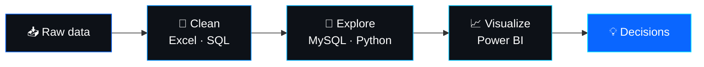
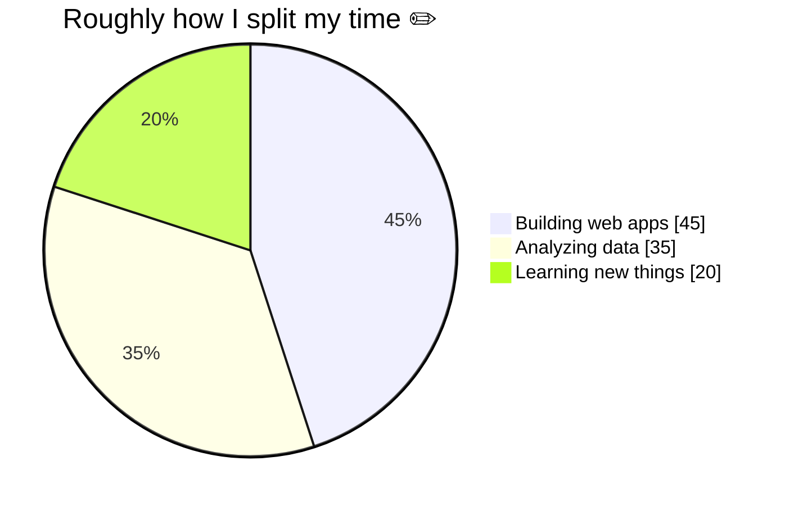

 

 

 

## 👋 A little about me

I'm Said, a developer who likes data just as much as code. Most days I'm either building a web app from scratch or digging through a messy spreadsheet looking for the story it's trying to tell.

I write my front ends in plain **HTML, CSS and JavaScript** because I like understanding exactly what's happening under the hood. I use **Node.js** and **Python** for the logic, **SQL** for the data, and **Power BI** when numbers need to become something people actually understand.

> 💬 *I believe good software and good analysis share one goal: making things clearer for the person on the other end.*

 

<table>
<tr>
<td width="50%" valign="top">

### 🧭 How I work
- 🎯 **Understand first**: I ask "why" before I write a line of code
- 🧼 **Keep it simple**: readable beats clever
- 🔁 **Iterate fast**: ship small, improve often
- 🤝 **Communicate clearly**: no jargon when plain words work

</td>
<td width="50%" valign="top">

### ⚡ Quick facts
- ☕ Favourite language: **JavaScript**
- 📊 Favourite tool for insights: **Power BI**
- 🌍 Based somewhere on Earth, working remotely
- 🌱 Currently learning: **DAX, Advanced SQL, Cloud** ✏️
- 💬 Ask me about: **JavaScript, SQL, dashboards**

</td>
</tr>
</table>

---

## 🧰 What I work with

<table>
<tr>
<td align="center" width="25%"><b>🌐 Frontend</b>  </td>
<td align="center" width="25%"><b>⚙️ Backend</b>  </td>
<td align="center" width="25%"><b>🗄️ Database</b>  </td>
<td align="center" width="25%"><b>🛠️ Tools</b>  </td>
</tr>
</table>

 

---

## 📊 From raw data to decisions

This is the workflow I follow on every data project:

<b>🔍 What that looks like in practice (click to expand)</b>

 

| Step | What I do | Tools |
|:--|:--|:--|
| **Clean** | Fix duplicates, missing values and inconsistent formats | Excel, SQL |
| **Explore** | Query, group and test ideas to find patterns | MySQL, Python |
| **Visualize** | Build dashboards people can read in 10 seconds | Power BI |
| **Share** | Explain what the numbers mean and what to do next | Plain language |

---

## 🎛️ Where my time goes

---

## 🎯 Right now

| 🔭 Building | 🌱 Learning | 🤝 Open to |
|:---:|:---:|:---:|
| Web apps and dashboards | DAX, Advanced SQL, Cloud | Collaboration, freelance, remote roles |

---

## 🤝 Let's connect

I'm always happy to talk about web development, data, or a project idea. The best way to reach me is LinkedIn.

  

⭐ *If something here helped you, a star on a repo means a lot.* ⭐

